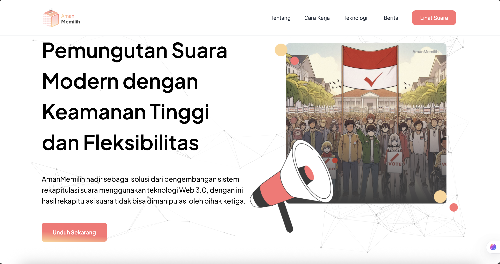

# AmanMemilih Next.js

> **Landing Page Preview**
>
> 

AmanMemilih adalah aplikasi web real count untuk pemilihan Presiden dan Wakil Presiden Indonesia, dibangun dengan Next.js, Tailwind CSS, dan teknologi Blockchain (Web3). Aplikasi ini menampilkan hasil suara, informasi kandidat, serta pencarian suara berdasarkan wilayah secara real-time dan responsif. Semua data suara dicatat secara transparan dan terdesentralisasi menggunakan smart contract blockchain untuk memastikan integritas dan keamanan data.

## Fitur Utama

- **Pantau Real Count**: Lihat hasil suara terkini untuk setiap pasangan calon (paslon) secara visual dan interaktif.
- **Pencarian Berdasarkan Wilayah**: Cari hasil suara berdasarkan provinsi, kabupaten/kota, kecamatan, kelurahan, dan TPS.
- **UI/UX Modern & Responsif**: Tampilan desktop dan mobile yang konsisten, dengan efek partikel di Hero Section.
- **Komponen Modular**: Hero, Footer, dan Card Info dipisah untuk desktop & mobile.
- **Optimasi Performa**: Menggunakan Next.js App Router, dynamic import, dan optimasi gambar.
- **Transparansi Blockchain**: Setiap suara dan data penting dicatat di blockchain publik melalui smart contract [go-amanmemilih](https://github.com/amanmemilih/go-amanmemilih), sehingga data tidak dapat dimanipulasi dan dapat diverifikasi oleh siapa saja.

## Arsitektur Blockchain

AmanMemilih terintegrasi dengan backend blockchain open source:

- **Smart Contract**: [go-amanmemilih](https://github.com/amanmemilih/go-amanmemilih) — kode sumber backend blockchain untuk pencatatan suara dan audit publik.
- **Web3 Integration**: Frontend Next.js berinteraksi dengan smart contract untuk submit dan verifikasi suara.
- **Keamanan & Transparansi**: Setiap transaksi suara dapat dilihat di blockchain explorer, memastikan tidak ada manipulasi data.

## Struktur Proyek

```
├── public/assets/images/      # Gambar kandidat, logo, ilustrasi
├── src/app/                  # Halaman utama, hasil suara, lihat suara
│   ├── page.jsx              # Landing page (Hero, Card Info, Footer)
│   ├── lihat-suara/page.jsx  # Halaman pantau suara & filter wilayah
│   └── hasil/[id]/[election]/page.jsx # Detail hasil suara per TPS
├── src/core/components/      # Komponen UI (Hero, Footer, Card, dsb)
├── src/core/utils/api.js     # Konfigurasi API (axios)
├── tailwind.config.js        # Konfigurasi Tailwind CSS
└── ...
```

## Instalasi & Menjalankan Lokal

1. **Clone repository**
   ```bash
   git clone <repo-url>
   cd amanmemilih-nextjs
   ```
2. **Install dependencies**
   ```bash
   npm install
   # atau
   yarn install
   ```
3. **Jalankan development server**
   ```bash
   npm run dev
   # atau
   yarn dev
   ```
4. Buka [http://localhost:3000](http://localhost:3000) di browser.

## Konfigurasi Lingkungan

- Pastikan endpoint API pada `src/core/utils/api.js` sudah sesuai dengan backend yang digunakan.
- Untuk pengembangan fitur MCP, Figma Dev Mode, dsb, cek pengaturan di `settings.json`.
- Untuk integrasi blockchain, pastikan backend [go-amanmemilih](https://github.com/amanmemilih/go-amanmemilih) sudah berjalan dan endpoint smart contract sudah dikonfigurasi.

## Penggunaan

- **Pantau Suara**: Klik menu "Lihat Suara" untuk melihat hasil real count nasional.
- **Cari Berdasarkan Daerah**: Gunakan form pencarian untuk filter hasil suara berdasarkan wilayah hingga TPS.
- **Detail Hasil**: Klik hasil TPS untuk melihat dokumen scan dan detail wilayah.
- **Verifikasi Blockchain**: Setiap suara dapat diverifikasi di blockchain explorer sesuai hash transaksi yang ditampilkan.

## Teknologi

- [Next.js 14+](https://nextjs.org/)
- [React 18+](https://react.dev/)
- [Tailwind CSS](https://tailwindcss.com/)
- [Axios](https://axios-http.com/)
- [particles.js](https://vincentgarreau.com/particles.js/)
- [Web3.js/Ethers.js](https://docs.ethers.org/) (integrasi blockchain)
- [go-amanmemilih (Blockchain Backend)](https://github.com/amanmemilih/go-amanmemilih)

## Kontribusi

1. Fork repo ini
2. Buat branch fitur: `git checkout -b fitur-anda`
3. Commit perubahan: `git commit -m 'fitur: deskripsi'`
4. Push ke branch: `git push origin fitur-anda`
5. Buat Pull Request

## Lisensi

MIT

---

> Dibuat oleh tim AmanMemilih. Untuk pertanyaan, silakan hubungi admin atau buka issue di repository ini.

This is a [Next.js](https://nextjs.org) project bootstrapped with [`create-next-app`](https://nextjs.org/docs/app/api-reference/cli/create-next-app).

## Getting Started

First, run the development server:

```bash
npm run dev
# or
yarn dev
# or
pnpm dev
# or
bun dev
```

Open [http://localhost:3000](http://localhost:3000) with your browser to see the result.

You can start editing the page by modifying `app/page.js`. The page auto-updates as you edit the file.

This project uses [`next/font`](https://nextjs.org/docs/app/building-your-application/optimizing/fonts) to automatically optimize and load [Geist](https://vercel.com/font), a new font family for Vercel.

## Learn More

To learn more about Next.js, take a look at the following resources:

- [Next.js Documentation](https://nextjs.org/docs) - learn about Next.js features and API.
- [Learn Next.js](https://nextjs.org/learn) - an interactive Next.js tutorial.

You can check out [the Next.js GitHub repository](https://github.com/vercel/next.js) - your feedback and contributions are welcome!

## Deploy on Vercel

The easiest way to deploy your Next.js app is to use the [Vercel Platform](https://vercel.com/new?utm_medium=default-template&filter=next.js&utm_source=create-next-app&utm_campaign=create-next-app-readme) from the creators of Next.js.

Check out our [Next.js deployment documentation](https://nextjs.org/docs/app/building-your-application/deploying) for more details.
